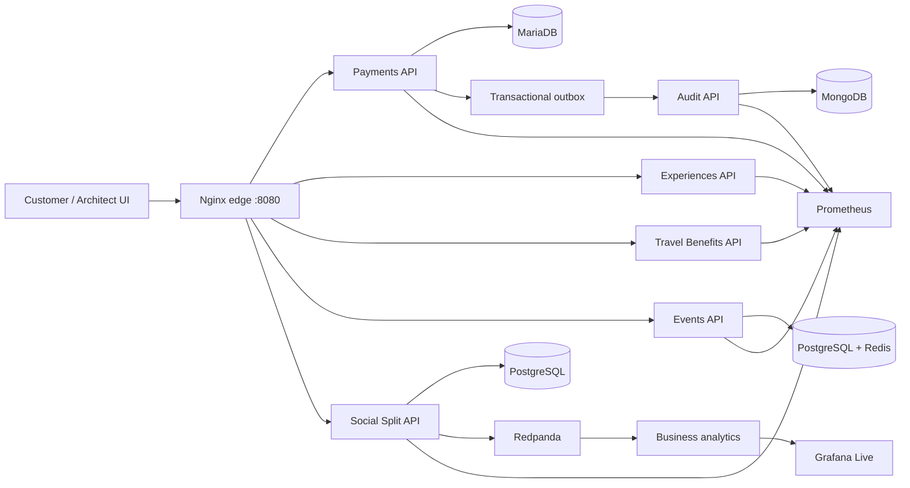

# BankPulse — Event-driven banking experiences

BankPulse is a distributed banking platform that explores how payments, premium experiences, travel benefits, event reservations and shared expenses can coexist behind one customer-facing application. The project combines domain-oriented services with reliable event delivery, live business observability and automated release controls.

The browser experience on port `8080` has two views: **Customer** presents the product journey, while **Architect** exposes service health, ownership boundaries and operational signals. Both views call the running APIs; the interface is not a static mock.

> **Project status:** the platform foundation and integration branch are green. The team is completing the domain event pipeline, recoverable analytics, Grafana Live panels and end-to-end acceptance harness. A separate reference implementation documents the target behavior without claiming those contributions for the team.

## Product experience

- **Payments:** create idempotent payment intents and correlate financial state with audit events.
- **Experiences:** discover dining benefits and create a demo payment guarantee.
- **Travel benefits:** evaluate eligibility, issue a signed credential and demonstrate offline verification.
- **Events:** reserve seats with Redis-backed holds, visible expiration and conflict handling.
- **Social Split:** create a group expense, add participants, authorize shares and close only when the total is consistent.
- **Platform view:** inspect service health, data ownership and links to Grafana, Prometheus and cAdvisor.

All accounts, amounts and authorizations are synthetic. An `ACCEPTED` payment represents a simulated workflow, not a real charge or settlement.

## Architecture



| Component | Responsibility | Storage |
| --- | --- | --- |
| `payments-api` | Idempotent payment workflow and financial authority | MariaDB |
| `audit-api` | Audit projection from confirmed payment facts | MongoDB `audit` |
| `experiences-api` | Dining benefits and experience catalogue | MongoDB `experiences` |
| `travel-benefits-api` | Eligibility and demo travel credentials | MongoDB `travel` |
| `events-api` | Events, seats and temporary holds | PostgreSQL + Redis |
| `social-split-api` | Shared-expense aggregate and payment references | PostgreSQL |
| `business-analytics` | Replayable business projection and freshness state | Owned analytics store |
| `console` | Product UI and HTTP edge | Nginx |

Each bounded context owns its writes. Sharing a database engine in a constrained development environment does not grant services access to another context's tables. See [data ownership](docs/architecture/DATA-OWNERSHIP.md) and the [technical blueprint](docs/architecture/TECHNICAL-BLUEPRINT.md).

## Run locally

Requirements: Docker with Compose v2 and about 8 GB available to Docker.

```bash
cp .env.example .env
COMPOSE_BAKE=false COMPOSE_PARALLEL_LIMIT=2 docker compose up -d --build --wait --wait-timeout 300
bash scripts/smoke-v2.sh
```

Open <http://localhost:8080>. The service ports remain private inside the Compose network.

Start the observability stack separately:

```bash
docker compose -f observability/compose.yaml up -d
```

| Surface | Local URL |
| --- | --- |
| Product console | <http://localhost:8080> |
| Grafana | <http://localhost:3000> |
| Prometheus | <http://localhost:9090> |
| cAdvisor | <http://localhost:8088> |

The checked-in Grafana account is only for local development. Do not expose this configuration publicly or reuse its credentials.

Stop the environment without deleting its volumes:

```bash
docker compose -f observability/compose.yaml down
docker compose down
```

For a disposable hosted environment, follow the [Codespaces guide](docs/CODESPACES.md).

## Quality and release controls

Pull requests pass through architecture, unit, integration and release checks. The integration suite builds the actual stack, checks health and readiness, exercises idempotency and observability, and preserves evidence before teardown. When the team acceptance harness is present, skipped resilience checks or API-only latency measurements fail the release.

The target business flow also proves a deliberate **false green**: infrastructure can remain healthy while a business invariant is broken. The required gate must block that revision, then pass only after the business correction. This gives the project a stronger signal than a conventional “containers are up” demo.

```text
feature branch -> pull request -> automated checks -> teammate review -> squash merge
```

See [CONTRIBUTING](CONTRIBUTING.md) for the workflow and [TEAM-INTEGRATION](docs/TEAM-INTEGRATION.md) for the event, analytics and acceptance contracts.

## Team

BankPulse is developed as a shared portfolio project. Credit follows merged code and reviewed evidence; an assignment alone is not treated as a completed contribution.

| Contributor | Workstream |
| --- | --- |
| [Nicolás](https://github.com/nikotov) | Domain rules, event contracts and reliable outbox publication |
| [Daniel Salazar](https://github.com/DanielSalazar0710) | Continuous analytics, deduplication and recoverable state |
| [oandretty010](https://github.com/oandretty010) | Grafana Live adapter, dashboards and reconnect behavior |
| [Roberto Villafuerte](https://github.com/VillaforTech) | Platform integration, Compose, CI and release controls |
| [Daniel Martínez](https://github.com/Dmt-155lbs) | End-to-end, resilience, latency and evidence automation |

The current implementation status and next action for each workstream live in [GitHub Issues](https://github.com/VillaforTech/bankpulse/issues).

## Engineering documentation

- [Architecture and ownership](docs/architecture/)
- [Operations runbook](docs/RUNBOOK.md)
- [Test plan](docs/TEST-PLAN-V2.1.md)
- [Observability](observability/README.md)
- [Security policy](SECURITY.md)
- [Release notes](RELEASE-NOTES.md)

## Project context

BankPulse also serves as a graded software-engineering case study. The course requirements shape the review process, reproducibility, evidence and release-gate scenarios, but the repository is maintained as a standalone portfolio product. Course-specific records remain under `docs/` so the public project story and the assessment trail are both explicit.
