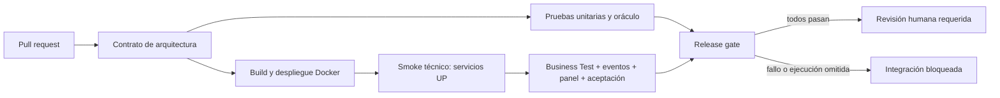

# BankPulse — aceptación de Social Split y observabilidad

PR [#7](https://github.com/VillaforTech/bankpulse/pull/7), relacionado con [#5](https://github.com/VillaforTech/bankpulse/issues/5). Harness inicial: Daniel Martínez (`Dmt-155lbs`). Integración y ampliación: Roberto Villafuerte con asistencia de Codex. La aprobación y el envío al aula son pasos separados de la validación técnica.

## Capacidad y riesgo

Un cierre exige participantes, cuotas positivas cuya suma exacta sea el total, autorización de todos y referencias no vacías. El cierre es idempotente y conserva `closedAt`. Un cierre de 100 con cuotas autorizadas 60+30 debe devolver 4xx y seguir OPEN. Salud técnica UP no demuestra este contrato. Los 10 de diferencia son exposición simulada; no hubo cobro ni pérdida financiera real.

El defecto histórico ya está corregido en `main` mediante #10. El harness elimina **solo en una copia temporal** la validación de suma, construye una imagen separada y verifica que la misma prueba de negocio falla con la API sana. La regresión del harness no modifica el árbol fuente ni se incorpora a `main`. Además, el PR de demostración #13 conserva una revisión defectuosa y su corrección para mostrar el bloqueo real de GitHub.

## Arquitectura y KPIs

API → PostgreSQL con outbox transaccional → Redpanda → analítica independiente con inbox/checkpoint SQLite → adaptador → Grafana Live → panel. El consumidor confirma después de persistir. Los temporizadores funcionan sin tráfico; el panel deja de mostrar datos como actuales tras tres segundos sin actualización.

- **B-K1:** porcentaje de cierres válidos en los últimos 15 minutos; sin cierres muestra SIN MUESTRA. Meta 100%.
- **B-K2:** suma de la diferencia absoluta entre total y cuotas autorizadas de los cierres de esa ventana, separada por moneda. Meta 0.
- **B-K3:** importe autorizado en sesiones OPEN con más de 120 segundos desde su creación, por moneda. Meta 0.

Los contratos detallados están en [eventos](events-deber-01.md) y [KPIs](kpis-deber-01.md). El oráculo independiente está en `tests/kpis`; la implementación está en `services/business-analytics`. No se agregan monedas incompatibles. La ventana de cierres es `[now - 900 s, now)`, con pruebas de ambos extremos tanto en la proyección como en el oráculo. El historial de snapshots está acotado y permite recuperar cursores antiguos desde una proyección completa.



## Pruebas y evidencia

| Prueba | Verificación | Artefacto |
|---|---|---|
| Negocio | 60+40 válido, 60+30 rechazado, consentimiento y cierre repetido; 5xx nunca cuenta como rechazo válido | `acceptance/business.log` |
| Latencia | 100 cierres reales; reloj monotónico desde antes del POST close hasta DOM correcto; B-K1=100 y B-K2=0; evento contrastado con outbox | `acceptance/latency.json`, `benchmark.png` |
| Broker | Crear mientras Redpanda está detenido; outbox pendiente, analítica degradada; recuperar y comprobar entrega | `acceptance/resilience.json` |
| Consumidor | SIGKILL, nueva operación durante caída, recuperación desde estado persistido sin pérdida | `acceptance/resilience.json` |
| Componente | Broker real: duplicados, desorden, recuperación de historial, reinicio y vencimiento sin eventos | `acceptance/component-resilience.json` |
| Live | Adaptador detenido y restaurado; el mismo panel pasa de ACTUAL a DESACTUALIZADO y vuelve | `live/*.png`, `live/result.json` |
| Deadline en pantalla | Regla real de 120 s, sin nuevas operaciones; suma independiente de compromisos abiertos; reacción ≤1 s | `acceptance/deadline.json`, `deadline.png` |
| Falso verde | Imagen mutada, API UP, business test rojo, KPI incumplido visible, restauración de imagen y test verde | `acceptance/false-green/` |
| Reconexión del navegador | Desconectar la red del contexto Chromium y recuperar en la misma página | `acceptance/false-green/reconnected.png` |

La latencia exige 100/100 renders, cero pérdidas/errores y p95 ≤1000 ms (rango más cercano, muestra ordenada 95). No se mide solo la respuesta HTTP. `ACTUAL` se normaliza a `FRESH` en el formato de evidencia. Los errores siguen en las muestras con penalización de al menos 10 segundos y siempre bloquean. La carga es secuencial; no demuestra rendimiento bajo concurrencia ni un SLO de producción. La consulta del evento persistido valida la correlación después de detener el reloj.

El temporizador del componente se acelera a 3 segundos en su Compose **aislado**; la regla de producción permanece en 120 segundos. Reinicio abrupto y replay no demuestran exhaustivamente todas las posiciones posibles de un crash. No se atribuye al harness reproducción independiente por un compañero.

La mutación no borra históricos: restaurar el código hace pasar nuevas pruebas, pero el cierre inválido permanece visible en la ventana de 15 minutos. La comprobación espera ese historial rojo. La prueba de mutación devuelve éxito solo si observa el fallo esperado y la recuperación; esto **no equivale** a una ejecución roja del Release Gate ni a observar un PR de regresión bloqueado en GitHub.

## Reproducción en un entorno limpio

Usar un Codespace/devcontainer nuevo o Docker local desechable: el harness detiene broker/consumidor y sustituye temporalmente la imagen de Social Split. No ejecutarlo en un despliegue compartido. Requisitos: Docker Compose, Python 3, Node 22 y recursos de `.devcontainer` (4 CPU, 8 GB RAM). No requiere servicios pagos externos.

Desde la raíz, con volúmenes nuevos:

```bash
export ANALYTICS_COVERAGE_FROM="$(date -u +%Y-%m-%dT%H:%M:%SZ)"
docker compose up -d --build --wait --wait-timeout 300
docker compose -f compose.yaml -f compose.analytics.yaml up -d --build --wait business-analytics
python3 scripts/analytics-integration.py
bash scripts/smoke-v2.sh
docker compose -f observability/compose.yaml up -d --build prometheus grafana grafana-live-adapter
npm install --prefix /tmp/live-browser playwright@1.51.1
/tmp/live-browser/node_modules/.bin/playwright install --with-deps chromium
export NODE_PATH=/tmp/live-browser/node_modules
node scripts/live-browser-test.cjs
bash scripts/acceptance/run-acceptance.sh
```

Abrir Grafana en `http://localhost:3000/d/bankpulse-deber-01`; las credenciales de laboratorio están en la configuración de observabilidad. Conservar `artifacts/` antes de cerrar el entorno. No reutilizar el volumen analítico con otro `ANALYTICS_COVERAGE_FROM`: define la población y es inmutable. Una segunda demostración sobre los mismos datos conserva el incumplimiento anterior; para medir otra base sana se necesita **otro entorno**, no borrar selectivamente el historial.

CI ejecuta el mismo runner, guarda SHA probado, run ID y logs antes del teardown. La prueba de resiliencia crea un proyecto Compose con nombre único y puerto dinámico y elimina únicamente sus propios volúmenes al terminar.

## Ciclo de bloqueo y recuperación observado

La [corrida integrada 35137501553](https://github.com/VillaforTech/bankpulse/actions/runs/35137501553), sobre el commit `2d68301`, pasó los cuatro checks. Acreditó recuperación de broker/consumidor, duplicados/desorden, vencimiento real de 120 s con reacción en pantalla de 214 ms y mutación con salidas 0 → 1 → 0 mientras la salud seguía UP. El cierre inválido se conservó (B-K2 USD 10). Para el benchmark vigente, que contrasta los tres paneles en cada muestra, consultar la última corrida del [PR #7](https://github.com/VillaforTech/bankpulse/pull/7/checks). `integration-evidence` contiene las muestras, capturas y SHA probado; cada resultado corresponde exclusivamente a esa revisión.

El [PR de demostración #13](https://github.com/VillaforTech/bankpulse/pull/13) demuestra el bloqueo real, separado de la mutación controlada del harness:

1. **Base sana:** [CI 35139056546](https://github.com/VillaforTech/bankpulse/actions/runs/35139056546), commit `b7978d7`, cuatro checks verdes. El benchmark registró 100/100 renders, cero pérdidas/errores y p95 573.567 ms; la reacción al vencimiento real fue 345.201 ms.
2. **Defecto intencional:** `b78d9a6` elimina únicamente la comparación entre suma de cuotas y total en `SplitSession.close`; las pruebas quedan intactas.
3. **Tecnología UP, negocio incorrecto:** [CI rojo 35150381217](https://github.com/VillaforTech/bankpulse/actions/runs/35150381217). Docker, analítica, smoke técnico y dashboard Chromium pasan. La prueba registra `[readiness] OK`, HTTP 200 y `COMPLETED` para 60+30 de 100: diferencia 10.00. Las pruebas unitarias también detectan el defecto.
4. **Bloqueo:** el job `Release gate` falla y GitHub registra `mergeStateStatus: BLOCKED`. La protección exige ese check y el de integración, rama actualizada y una aprobación; ni un revisor ni un administrador pueden convertir checks rojos en un merge normal. No se intentó fusionar la revisión defectuosa.
5. **Diagnóstico y corrección:** `16389a0` restaura la validación exacta dentro del agregado. Es la única diferencia respecto de la revisión defectuosa; se vuelven a ejecutar las mismas pruebas en el mismo PR.

La [evidencia conservada](evidence/release-gate-2026-09-16/) incluye el diff de la mutación, log de negocio, contenedores, estado bloqueado y protección vigente. Los artefactos completos están en la ejecución enlazada. El estado bloqueado tenía además una revisión humana pendiente; el fallo de los checks obligatorios es un impedimento independiente.

### Correspondencia con el enunciado

| Criterio | Puntos | Evidencia |
|---|---:|---|
| Riesgo convertido en prueba computable | 3 | Capacidad, diferencia 10.00, prueba 60+30 y log rojo |
| Release Gate funcional | 5 | Diagrama, workflow, PR verde #7 y revisión roja de #13 con servicios UP y bloqueo |
| Diagnóstico y recuperación reproducible | 2 | Diff de una línea, corrección, ejecución posterior y comandos del devcontainer |

El archivo requerido es `docs/deber-01.md`. El enunciado permite elegir la capacidad; el pago duplicado es un ejemplo, no una obligación adicional a Social Split. Se entrega el enlace al repositorio GitHub. Una ejecución local de devcontainer no acredita una prueba en Codespaces ni una reproducción independiente por un compañero. El envío al aula se confirma aparte con su recibo.

| Trabajo | Autor original / PR |
|---|---|
| Social Split y eventos | Nicolás Tovar (`nikotov`) / #10; correcciones e integración por Roberto |
| Analítica persistente | Daniel Salazar / #8; integración y pruebas por Roberto |
| Grafana Live | `oandretty010` / #11; integración y pruebas por Roberto |
| Harness y oráculo | Daniel Martínez / #7; ampliación e integración por Roberto |
| Infraestructura y gate | Roberto / #9, incorporado en #10 |

Los PRs y sus commits conservan la atribución real; esta tabla no acredita trabajo futuro ni revisión pendiente.
